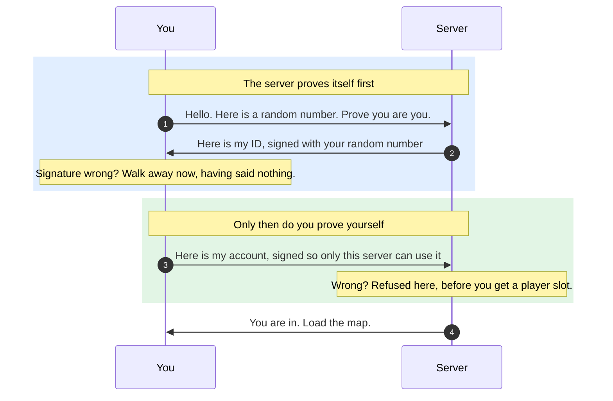

# Automated Anonymous Accounts (AAA)

Every player has an account. Nobody signs up, nobody logs in, and there is no account server.



## How

One secret per machine. Your account on a server is derived from that secret plus the server's
public key.

```
account = truncate( sha256( tag | your secret | server public key ) )
```

So one operator sees one stable account for you forever, and unrelated operators cannot tell that
two of their players are the same person.

## Files

`<config>/identity/`

| File | What |
|---|---|
| `client-auth.key` | Your secret. 64 hex characters. Back it up. |
| `client-auth.2.key` | The second copy of the engine on this machine, and so on to 8. |
| `server-auth.key` | The identity your server presents when you host. |
| `*.key.lock` | Empty. Each running copy holds one open so two never share a key. |

Anyone holding your key is you. No server has a copy, so a lost key is a lost account.

## Joining

The three steps above ride on messages the join already sends, so this costs no extra round trips.

**The server signs first**, before the client names an account. A server that copied a real
server's public key cannot produce that signature, so the client leaves before it can be used to
relay a proof to the real one.

A client that fails is refused here, before it gets a player slot or a snapshot.

Nothing in this is delivered reliably, so a challenge is minted once per client and re-sent
unchanged on every retry. Otherwise a dropped packet would refuse an honest player.

## For modders

Unchanged. `GetPlayerAccountName` and `PlayerIsLoggedIn` work as before. The name is now 32 hex
characters instead of a chosen username, and is stable per player per operator, so anything using
it as a database key keeps working.

## Costs nothing at runtime

Keys are read once at startup. A join is two signatures and a key agreement: no disk, no network.
That is why the account server was dropped rather than reimplemented.
