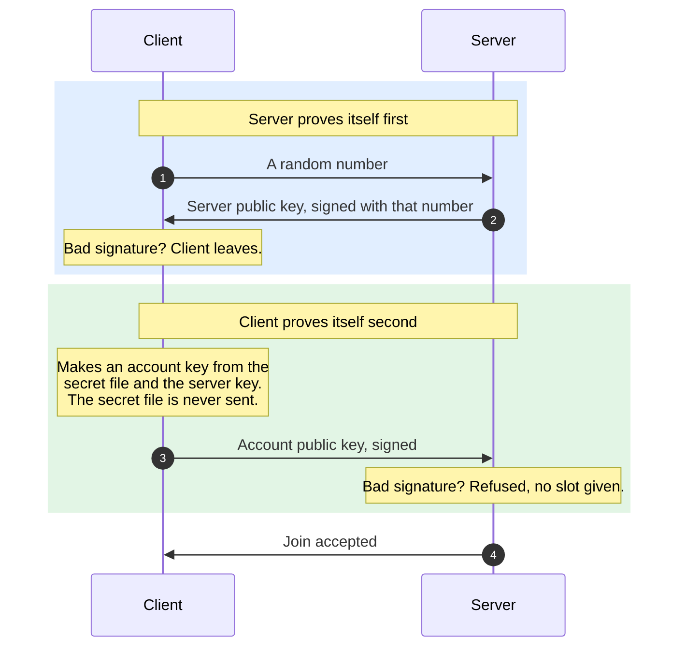

# Automated Anonymous Accounts (AAA)

Accounts are now as hassle-free as possible for users and modders. Instead of a third-party authentication server, we've shifted towards anonymous accounts with a 100% adoption rate.

## How

1. First run makes one secret file, shared by every ForkUnderA on that machine.
2. On joining a server, the client derives a separate account key from that secret plus the server's public key.
3. The secret never leaves the machine. The client sends only the derived public key and a signature proving it holds the matching private half.
4. The server checks the signature, and knows this is the same player as last time without ever learning the secret.
5. Same server, same account, forever. A different owner's server gives a different account, and nobody can tell they are the same person.

## For modders

Nothing changed. `GetPlayerAccountName` and `PlayerIsLoggedIn` work as before.

The name is now 32 hex characters instead of a chosen username. It is stable per player per server
owner, so anything using it as a database key keeps working.

## Where the file is

One folder per user, shared by every copy of the engine on the machine, including portable ones.

| System | Folder |
|---|---|
| Windows | `%LOCALAPPDATA%\ForkUnderA\identity\` |
| macOS | `~/Library/Application Support/ForkUnderA/identity/` |
| Linux | `~/.config/ForkUnderA/identity/` |

`client-account-auth.key` is the player. `server-account-auth.key` is the identity their server presents when they
host. Numbered files like `client-auth.2.key` belong to a second copy of the engine running at the
same time, so two windows are two players.

## Transferring an account

If you're on a new machine and want to keep your old account, just replace the new `client-account-auth.key` with your old one. For server administrators transferring machines, this also means you'll need to transfer your old `server-account-auth.key` alongside any database files for a seamless transition.

## Deleting an account

Delete `client-account-auth.key` file. The next launch generates a brand new anonymous account. **If you permanently delete the `client-account-auth.key` there is no way to get your account back.**

## Recovering an account
There is **no way** to recover a compromised account. This is the cost of this system. Never share your `client-account-auth.key` with anyone.
