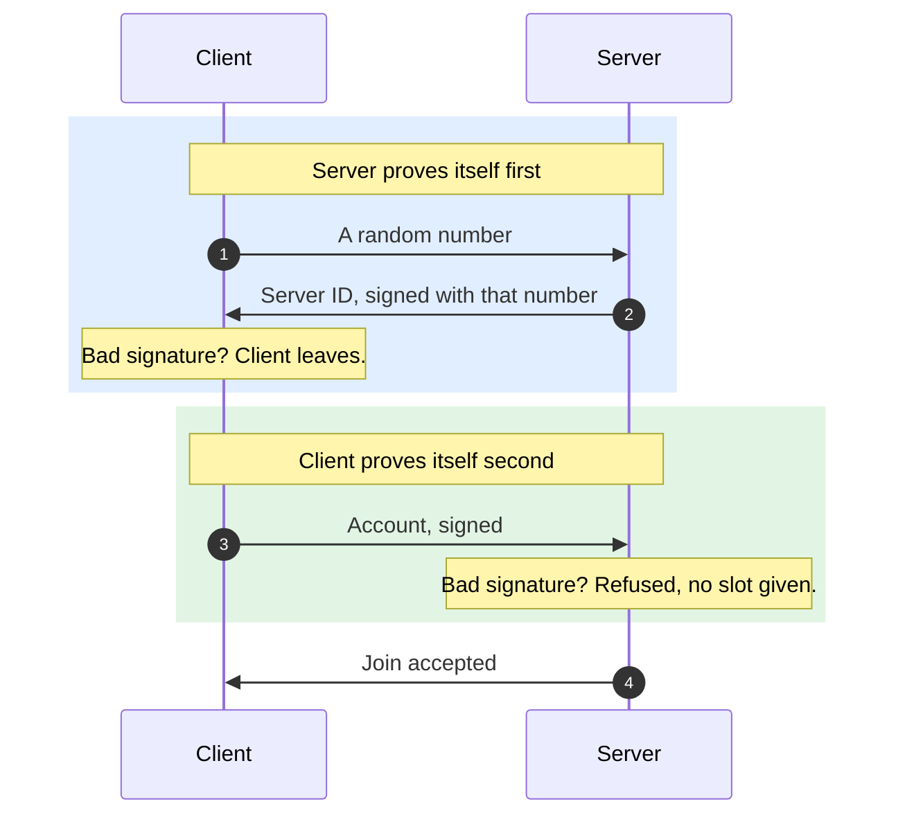

# Automated Anonymous Accounts (AAA)

Servers get a stable identity to hang progress, ranks and bans on, without anyone registering,
logging in, or trusting a login server.

## How

1. On first run the engine makes one secret file for the player.
2. On joining a server, the account is that secret mixed with the server's public key.
3. The same server tomorrow gives the same account. It never expires and nothing stores it.
4. A different owner's server gives a different account, and the two cannot be linked.

## Where the file is

One folder per user, shared by every copy of the engine on the machine, including portable ones.

| System | Folder |
|---|---|
| Windows | `%LOCALAPPDATA%\ForkUnderA\identity\` |
| macOS | `~/Library/Application Support/ForkUnderA/identity/` |
| Linux | `~/.config/ForkUnderA/identity/` |

`client-auth.key` is the player. `server-auth.key` is the identity their server presents when they
host. Numbered files like `client-auth.2.key` belong to a second copy of the engine running at the
same time, so two windows are two players.

## Deleting an account

Delete `client-auth.key`. The next launch makes a new one, and the player is a new person
everywhere.

There is no undo and no way back to the old account.

## Keep it private

> [!WARNING]
> Whoever holds `client-auth.key` **is** that player, on every server they play on.
>
> No server keeps a copy, so nobody can verify, restore, or revoke it on their behalf. Never paste
> it, screenshot it, or put it in a mod, a bug report, or a synced cloud folder.

## For modders

Nothing changed. `GetPlayerAccountName` and `PlayerIsLoggedIn` work as before.

The name is now 32 hex characters instead of a chosen username. It is stable per player per server
owner, so anything using it as a database key keeps working.
