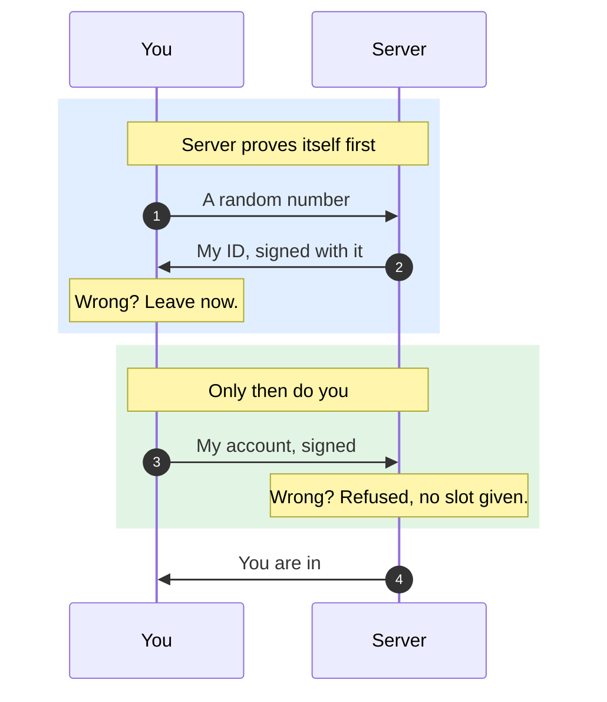

# Automated Anonymous Accounts (AAA)

Every player has an account. Nobody signs up, nobody logs in, and there is no account server.

## How

1. On first run the engine makes one secret file on your machine.
2. When you join a server, your account is that secret mixed with the server's public key.
3. Same server tomorrow, same account. It never expires and nothing stores it.
4. A different owner's server gives you a different account, and the two cannot be linked.

## Where the file is

A folder called `ForkUnderA/identity/`, next to wherever the engine keeps its config.

| Setup | Folder |
|---|---|
| Portable (an `.ini` sits beside the exe) | `<install>\ForkUnderA\identity\` |
| Windows | `%APPDATA%\ForkUnderA\ForkUnderA\identity\` |
| macOS | `~/Library/Preferences/ForkUnderA/identity/` |
| Linux | `~/.config/forkundera/ForkUnderA/identity/` |

Inside, `client-auth.key` is you. `server-auth.key` is the identity your server presents when you
host. Numbered files like `client-auth.2.key` belong to a second copy of the engine running at the
same time, so two windows are two players.

## Deleting your account

Delete `client-auth.key`. The next launch makes a new one, and you are a new player everywhere.

There is no undo and no way back to the old account.

## Keep it private

> [!WARNING]
> Anyone who has your `client-auth.key` **is** you, on every server you play on.
>
> No server holds a copy, so nobody can verify you, restore you, or take it back for you.
> Do not paste it, screenshot it, or put it in a mod, a bug report, or a cloud sync folder.

## For modders

Nothing changed. `GetPlayerAccountName` and `PlayerIsLoggedIn` work as before.

The name is now 32 hex characters instead of a chosen username. It is stable per player per server
owner, so anything using it as a database key keeps working.
