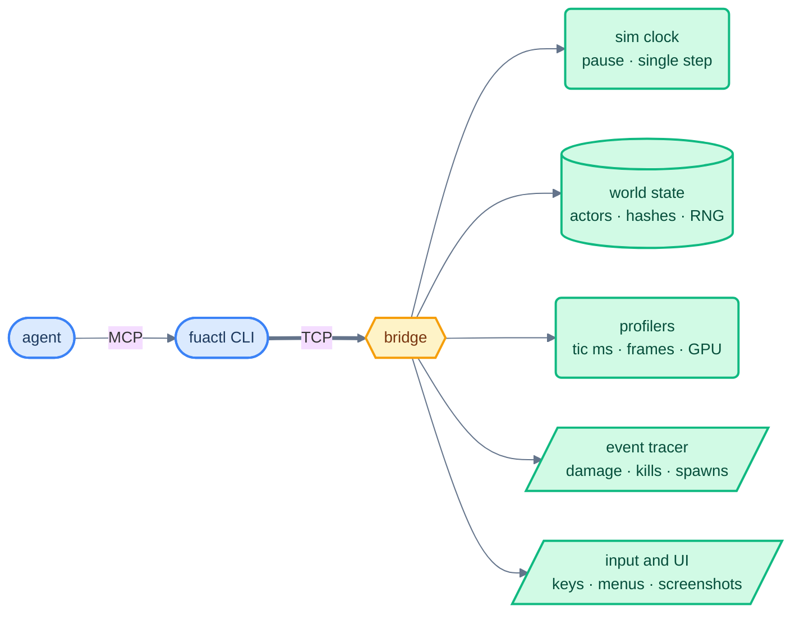

# fuactl

Reproducing a bug or a lag spike by hand is guesswork: no two runs are alike, and you cannot see inside a slow frame. fuactl fixes that by making a dev engine fully scriptable. Launch it, run it one tic at a time, read its world, measure its frames, and get the exact same run every time.



## Quick start

```sh
ZX_MCP_BRIDGE=1 ./mac_compile.sh              # build a driveable engine
cd tools/fuactl && npm install
npx fuactl launch --map map01 --seed 777      # prints port + token
npx fuactl rpc sim.pause --port <P>
npx fuactl rpc sim.step '{"tics":1}' --port <P>
```

`npx fuactl mcp` exposes the same surface as an MCP server for agents.

## What it does

| Area | RPCs | Use |
|---|---|---|
| Sim control | `sim.pause` `sim.step`, etc | run exactly N tics, every time |
| Determinism | `sim.hash` `sim.trace`, etc | compare two runs: world hash, every RNG stream, every damage/kill/spawn |
| Profiling | `perf.ticprof` `perf.capture`, etc | what is inside a slow tic; what composes a spike frame; GPU ms per pass |
| State | `sim.tic` `state.actors`, etc | leveltime, positions, health, class names |
| Driving | `console.exec` `ui …`, etc | commands, keys, menu reading, screenshots |
| Triage | `fuactl hang` `fuactl doctor` | why an instance stopped answering, and whether this build is driveable at all |

### When an instance stops answering

```sh
npx fuactl hang --port <P>     # gone / unreachable / stalled / paused / healthy + the stuck function
npx fuactl doctor              # is the configured engine bridge-enabled, and newer than the source?
```

`hang` separates the four things that look identical from outside: the process died, it is spinning
inside one function so it never polls the bridge again, it polls but the tic is frozen, or it is
simply paused. When it is stuck it samples the process and names the top-of-stack function. `doctor`
catches the other trap — a plain release build in the engine path can't be driven at all, and fails
with "bridge port never opened", which says nothing about the bridge.

## Release builds

The bridge is off unless `ZX_MCP_BRIDGE=1` at build time. Off means: no sockets, no RPC code, every engine anchor compiles to nothing, `nm` finds zero bridge symbols.

## Where

| What | Path |
|---|---|
| CLI | `tools/fuactl/` |
| Engine side | `src/zandronum/src/mcp_*.{h,cpp}` |
| Full RPC reference | `src/zandronum/src/features/mcp-bridge/README.md` |
