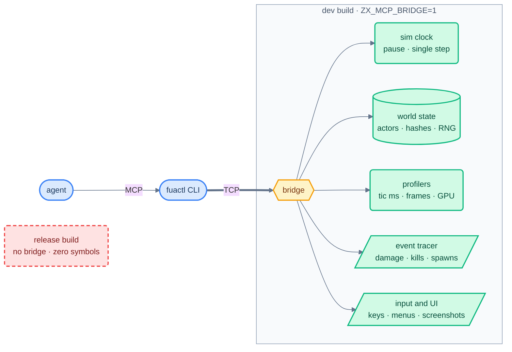

# fuactl

Reproducing a bug or a lag spike by hand is guesswork: no two runs are alike, and you cannot see inside a slow frame. fuactl fixes that by making a dev engine fully scriptable. Launch it, run it one tic at a time, read its world, measure its frames, and get the exact same run every time.



## Quick start

```sh
ZX_MCP_BRIDGE=1 ./mac_compile.sh              # build a driveable engine
cd tools/fuactl && npm install
npx fuactl launch --map map01 --seed 777      # prints port + token
npx fuactl rpc sim.pause --port <P>
npx fuactl rpc sim.step '{"tics":1}' --port <P>
```

`npx fuactl mcp` exposes the same surface as an MCP server for agents.

## What it does

| Area | RPCs | Use |
|---|---|---|
| Sim control | `sim.pause` `sim.step`, etc | run exactly N tics, every time |
| Determinism | `sim.hash` `sim.trace`, etc | compare two runs: world hash, every RNG stream, every damage/kill/spawn |
| Profiling | `perf.ticprof` `perf.capture`, etc | what is inside a slow tic; what composes a spike frame; GPU ms per pass |
| State | `sim.tic` `state.actors`, etc | leveltime, positions, health, class names |
| Driving | `console.exec` `ui …`, etc | commands, keys, menu reading, screenshots |

## Release builds

The bridge is off unless `ZX_MCP_BRIDGE=1` at build time. Off means: no sockets, no RPC code, every engine anchor compiles to nothing, `nm` finds zero bridge symbols.

## Where

| What | Path |
|---|---|
| CLI | `tools/fuactl/` |
| Engine side | `src/zandronum/src/mcp_*.{h,cpp}` |
| Full RPC reference | `src/zandronum/src/features/mcp-bridge/README.md` |
