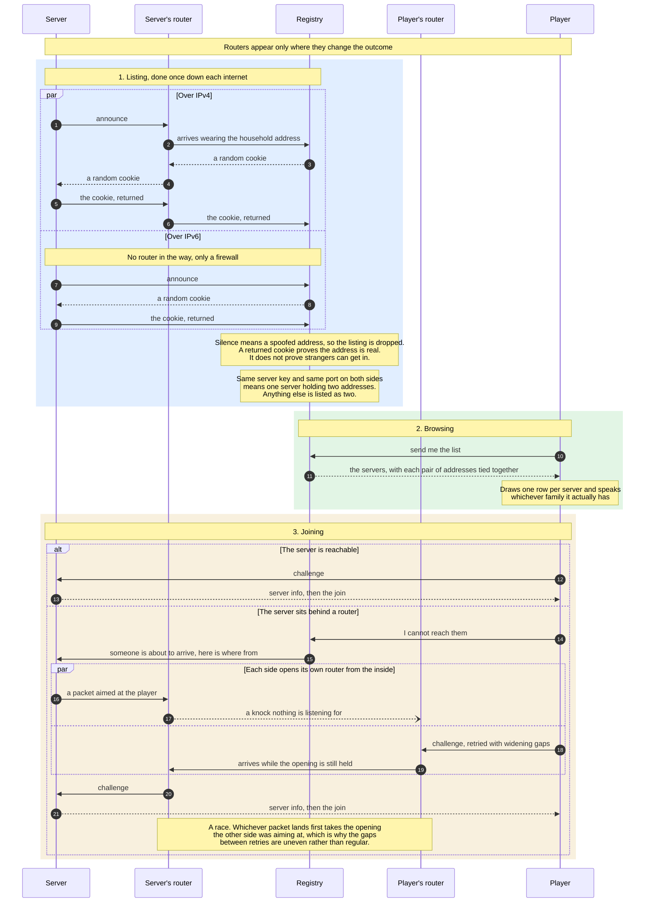

# The Server Registry

A registry is a phone book. Servers write themselves into it, players read it, and neither has to know the other exists beforehand. ForkUnderA ships pointing at one run by rc4l, but the phone book is not owned by anybody. A registry is a small program anyone can run, and the client will read from several at once.

