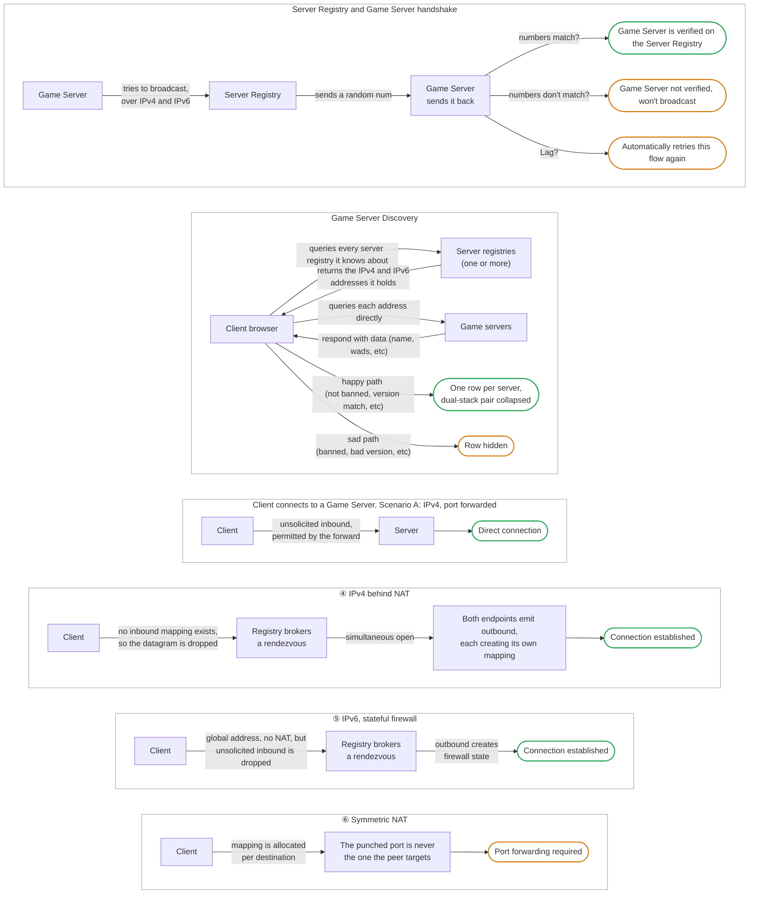

# The Server Registry

A Server Registry is what we'd formerly call a Master Server. It used to be effectively a dumb application hosted on the cloud that only serves a list of ip addresses to Game Servers for valid users. With ForkUnderA, it's upgraded to a verifying, federated broker: it challenges every announcement so a listing cannot be forged, speaks IPv4 and IPv6 as one, and introduces players directly to servers whose owners never touched a router setting. Anyone can run one in a container and point their community at it, so the list is no longer a single service everybody has to trust or wait on.

Below are some high level architecture diagrams on how it all works.

