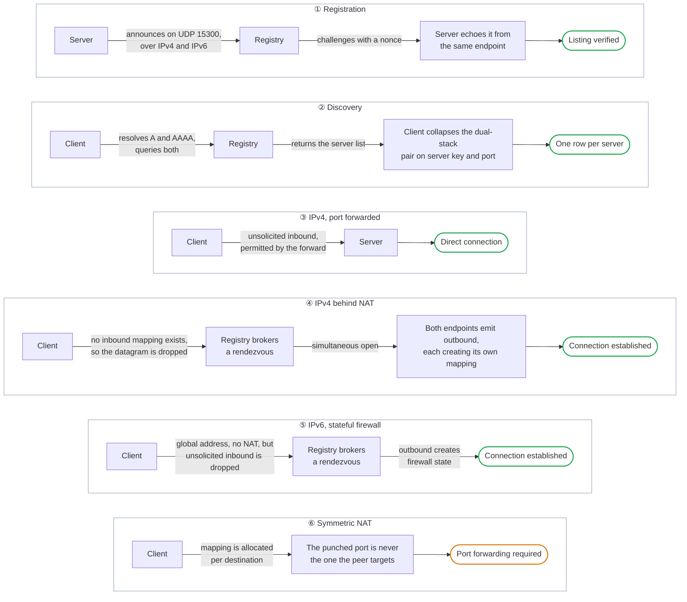

# The Server Registry

A registry is a phone book. Servers write themselves into it, players read it, and neither has to know the other exists beforehand. ForkUnderA ships pointing at one run by rc4l, but the phone book is not owned by anybody. A registry is a small program anyone can run, and the client will read from several at once.

## Terminology

| Term | What it means |
|---|---|
| **Datagram** | A single UDP packet. It is sent and either arrives or does not, with no handshake and no acknowledgement, which is why every mechanism below is about who is allowed to send one to whom. |
| **Announce** | A server telling a registry it exists. Repeated at intervals, because a listing that is never refreshed is indistinguishable from a server that has gone away. |
| **Nonce** | A number used once. The registry invents one and will only list a server that sends the same number back, which proves the announcement came from the address it claimed rather than from someone typing that address into a packet. |
| **Endpoint** | An address and a port together. The distinction matters here because NAT rewrites both, so the endpoint a server believes it has and the one the world sees are frequently different. |
| **A and AAAA** | The two kinds of DNS record that answer "where is this host". A gives an IPv4 address, AAAA an IPv6 one. A name can have both, one, or neither, and asking for the wrong one is how a working host looks unreachable. |
| **Dual-stack** | Running IPv4 and IPv6 at the same time. A dual-stack server is two addresses for one machine, which is why the browser has to recognise the pair and draw one row. |
| **Server key** | The public half of the identity a server presents. Combined with its port it is what lets the registry tell "one server on two addresses" from "two servers". |
| **NAT** | Network Address Translation. A router presenting many private addresses to the internet as one public address, rewriting the endpoint of everything passing through. It is what made IPv4 survive running out of addresses, and what makes an unforwarded server unreachable. |
| **Mapping** | The temporary hole NAT creates when something inside sends out. It admits replies from that destination for a while, then expires. Nothing inbound arrives without one. |
| **Unsolicited inbound** | A packet arriving from someone the machine has not recently sent to. Both NAT and firewalls drop it by default, which is the entire problem the registry exists to work around. |
| **Stateful firewall** | A firewall that permits inbound traffic only where it matches something previously sent out. IPv6 hosts usually sit behind one, so a global address still does not mean a reachable one. |
| **Rendezvous** | An introduction performed by a third party. The registry can reach both sides, so it tells each about the other at the same moment, which neither could have learned alone. |
| **Simultaneous open** | Both ends sending outward at once so that each opens its own mapping. Neither packet is expected to be answered. Their only purpose is to make the router treat the reply as solicited. |
| **Symmetric NAT** | NAT that allocates a fresh mapping per destination rather than per source. The mapping opened toward the registry therefore tells nobody which mapping a peer should aim at, so no amount of introduction helps. |
| **Port forwarding** | A permanent, manually configured mapping. It is the one method that always works, at the cost of having to be set up by hand. |
