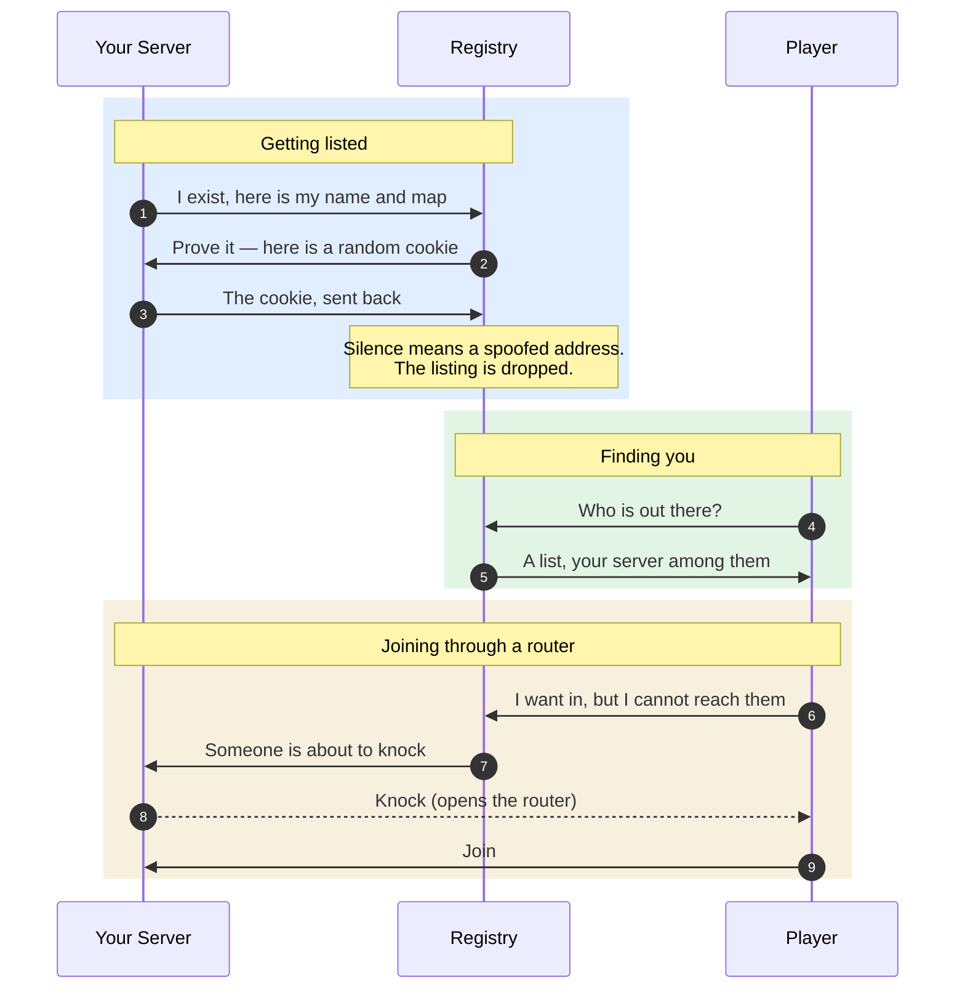

# The Server Registry

A registry is a phone book. Servers write themselves into it, players read it, and neither has to know the other exists beforehand. ForkUnderA ships pointing at one run by rc4l, but the phone book is not owned by anybody — a registry is a small program anyone can run, and the client will read from several at once.



## Getting listed

Your server tells the registry it exists, and keeps saying so at intervals. The registry does not take its word for it: it replies with a random number and waits for that number to come back from the same address. An announcement that never answers is discarded.

This is worth understanding, because it is the reason a listing can fail silently. Anyone can send a packet claiming to be anyone. The cookie is what separates "a server at this address" from "a packet that says so", and only the real occupant of an address can answer.

What it does **not** prove is that other players can reach you. The cookie travels back along a path your server just opened by sending outward, which is the easy direction. Whether a stranger can get in unprompted is a different question, and the honest answer is below.

## "It shows up on LAN but not in the list"

Almost always the announcement is not arriving, or its cookie is not coming back. `fua_hostdiag` prints what the server believes about itself: whether it announced, whether it was verified, and how long ago. Start there rather than guessing.

The usual causes, in the order they actually occur: outbound UDP blocked by a firewall, a registry hostname that does not resolve, or a machine with a working IPv6 address whose network drops IPv6 in one direction. That last one is common and produces the most confusing symptom, because half of what you do works.

## Hole punching, or why port forwarding is often unnecessary

A home router keeps no door open to the outside. It opens one only when something inside sends out, and then it holds that opening for a while and lets replies back through. A player trying to reach an unforwarded server is knocking on a wall.

So the registry introduces you. When a player cannot reach a server, it asks the registry, which tells the server that someone is about to arrive. The server sends a packet outward at that player — which is useless in itself, since nothing is listening yet — and in doing so punches an opening in its own router. The player's next packet arrives through it.

Both sides do this at once, a few times, spaced out. The spacing is not decoration: this is a race, and whichever packet reaches the far router first claims the opening the other side needs. Getting the timing wrong does not fail loudly, it just fails.

This works for most home routers and fails for some. Routers that assign a new outbound port for every destination — "symmetric" NAT, common on mobile networks — cannot be punched through, because the opening made for one destination is not the opening the other party is aiming at. Port forwarding remains the certain answer. Punching is what makes the uncertain case work often enough that most people never need to know any of this.

## IPv4 and IPv6

There are two internets running over the same wires.

IPv4 addresses are the familiar four numbers, and there are about four billion, which ran out years ago. What holds it together is that most homes share one address across every device behind a router — which is precisely why the previous section exists. IPv6 addresses are longer, there are effectively unlimited numbers of them, and every device can hold one of its own.

A server with both announces itself twice, once down each internet, because they are separate paths and either can be broken while the other works. That would put you in the list twice, so the registry ties the two announcements together — same server key, same port — and the browser draws one row. If anything about that pairing looks wrong, both rows are shown rather than one, on the principle that a duplicate is an annoyance and a hidden server is a bug.

Players on IPv4-only connections lose nothing. A dual-stack server is reachable over IPv4 exactly as it always was.

## Bans

Bans are by address, and always will be. An IPv4 rule takes the wildcard everyone already knows:

```
1.2.3.*
```

IPv6 does not work that way, because the unit an ISP hands out is not a single address but a block — usually a /64, meaning the first 64 bits identify the household and the rest are theirs to spend. So an IPv6 ban is a prefix, written in brackets:

```
[2001:db8::/64]
```

The wildcard form is accepted too, and means the same thing: `[2001:db8:*]` is `[2001:db8::/32]`. A prefix with no length is refused rather than assumed, because the friendly guess and the dangerous one differ by a single omission — read as `/128` it bans one person, read as `/0` it bans the internet. Say the number.

## Flags

The country beside each server comes from a table inside `fua_core.pk3`, not from a service — nothing about your address is sent anywhere to draw it. Both address families are covered. IPv6 is resolved to the /64 block, which is as fine as the underlying data meaningfully goes.

A missing flag means the table has nothing for that address. It is not an error, and it is deliberately preferred to a confident wrong guess.

## Running your own registry

The client reads a list of registries and queries all of them, so a community can run its own without leaving the default behind and without asking anyone's permission. The list lives at `cl_fua_serverregistrylist_url`; the built-in entry is the rc4l registry. Point `fua_serverregistry_host` at your own to have a server announce elsewhere.

The registry itself is a single small daemon. It holds no accounts and stores nothing durable — it is a phone book, and phone books are cheap.

## Console reference

| Command | What it tells you |
|---|---|
| `fua_hostdiag` | Whether your server announced, was verified, and when |
| `fua_landiag` | What LAN discovery is seeing on this machine |
| `dumpserverlist` | Every server the browser currently holds |

| Setting | Meaning |
|---|---|
| `sv_fua_serverregistry_announce` | Whether this server lists itself publicly |
| `fua_serverregistry_host` | Which registry it announces to |
| `cl_fua_serverregistrylist_url` | Where the client fetches its list of registries |
| `sv_broadcast` | Whether this server announces on the local network |
