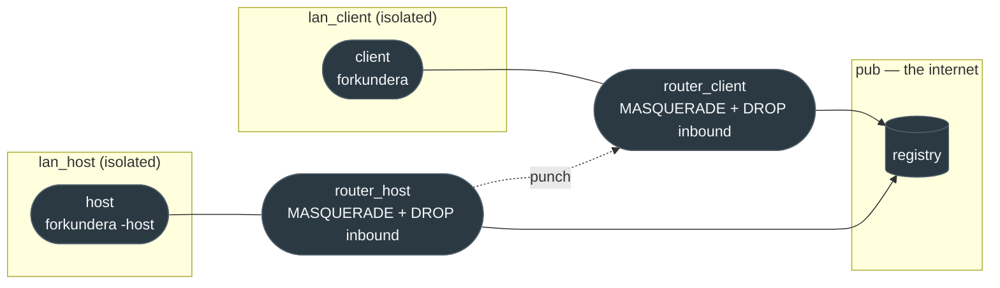

# natlab

**Problem:** a server can compile, boot, pass every unit test and still be unjoinable, because the
one thing that decides whether players can reach each other is a router neither we nor they control.
The only test that ever covered it was a person with a laptop on a phone hotspot, run by hand, which
is not something you can do per release.

**Solution:** two engines behind two simulated home routers, with a registry in the middle, in
containers, in CI.



Neither peer is on `pub`. Their LANs are `internal: true` and their routers drop unsolicited inbound,
so **a connection that succeeds could only have been carried by the mechanism under test**.

## Run it

```sh
ZX_MCP_BRIDGE=1 ./linux_compile.sh --no-package     # the lab drives the engine through the bridge
tools/natlab/run.sh                                  # both ends port-restricted
tools/natlab/run.sh --host-nat symmetric             # the case punching cannot solve
tools/natlab/run.sh --keep                           # leave it up to poke at
```

Linux only: it needs real network namespaces.

## What it asserts

| # | Assertion | Why it is there |
|---|---|---|
| 0 | the peers **cannot** ping each other | without this the rest is vacuous |
| 1 | the host is listed by the registry | outbound works through NAT |
| 2 | the host is **not** verified | the NAT is real, and `hostdiag` says so honestly |
| 3 | the client finds the server via the registry | discovery, not LAN broadcast |
| 4 | the **server** reports a connected client | the only proof a punch carried something |

Assertion 0 is the important one. Delete the `DROP` rule in `router.sh` and every other assertion
still passes while proving nothing, so the fixture is checked before it is trusted.

## The latency is load-bearing

`router.sh` puts 25ms on each link, and removing it does not make the lab faster, it makes it wrong.

NAT traversal is a race. Each side must get its packet away before the other's arrives, because
whichever lands first creates a tracked entry whose reply tuple is exactly the one the other side's
outbound needs — so that side's port is rewritten and the hole opens where nobody is knocking. On a
0ms link the race cannot be won: the far packet always arrives before the engine's next 28ms tic.

This cost three rounds of "fixes" to code that turned out to be correct. The symptom moved each time
and never went away:

| ordering | who lost |
|---|---|
| challenge first | host's punch rewritten (10666 → 18200) |
| punch first, 600ms lead | joiner's challenge rewritten (10667 → 64080) |
| punch first, released on the broker verdict | joiner's challenge rewritten (→ 52842) |
| all of the above, plus 25ms links | **passes** |

If a network test fails in a way that keeps moving rather than disappearing, suspect the fixture's
notion of time before suspecting the protocol.

## The dual-stack case

`run-dualstack.sh` is a separate fixture for a separate question: a server announces once per family
from one socket, so the registry holds two entries and every dual-stack server would appear twice.

Deliberately no NAT — dedupe has nothing to do with traversal, and routing it through masquerading
routers would add NAT66 to a test that would then fail for unrelated reasons. What it does need, and
what nothing else in this repo has, is a registry **hostname carrying both an A and an AAAA record**;
that is the only thing that makes an engine send the second announce at all. `extra_hosts` supplies
both.

It exists because everything on that path failed silently. The IPv6 announce went to a byte-swapped
port and had never once arrived on any build; a registry named by an IPv6 address was dropped from
the list without a word; grouping and its collision guard had never run. None of those produce an
error message, which is precisely why a machine has to check them.

### The v6-only client

The last assertion takes the client's IPv4 address away and restarts it. That case exists because the
bug it guards against is invisible on any machine we own: the client resolved its registry with an
IPv4-only lookup, so a player with no IPv4 reached no registry and saw an empty browser with no
error. Every developer machine is dual-stack, so nothing short of removing the address finds it.

## The matrix

| host NAT | what a pass means |
|---|---|
| `fullcone` | discovery works end to end. Says **nothing** about punching: the mapping accepts anyone, so the ordinary challenge is what got in. |
| `portrestricted` | the real proof. Neither side reachable, and the joiner still connects. |
| `symmetric` | punching cannot work; the pass is that it fails cleanly and the client does not wedge. |

## Symmetric NAT

Expected to fail the punch, and the lab says so rather than pretending otherwise: the mapping the
registry observed is not the mapping the host is told to aim at. What is asserted there is clean
degradation — the client must not hang — because a wedged client is the failure a player would feel.
